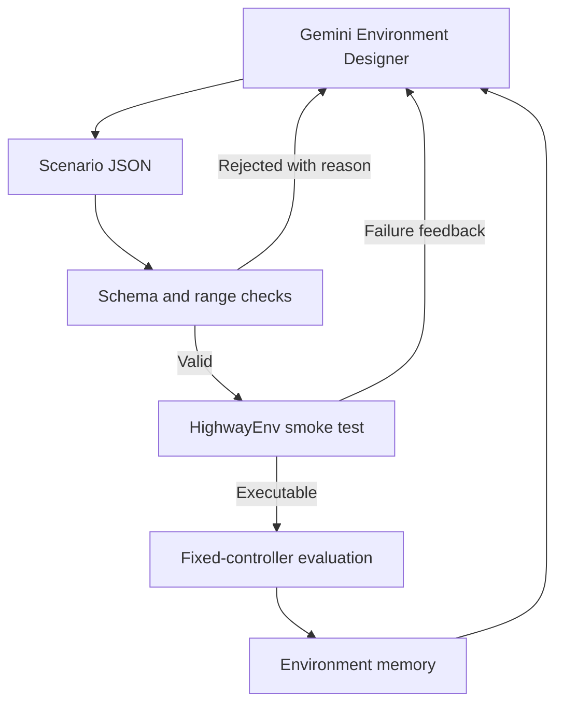

# SPADE-Inspired Environment Design HighwayEnv

**Student:** Xiangzhao Chen  
**Environment library:** HighwayEnv 1.12.1  
**Domain:** Autonomous-driving decision making  
**Environment Designer:** Gemini API (`gemini-3.8-flash`, as configured for this experiment)  
**Date:** September 27, 2026

## Abstract

This project implements a SPADE-inspired Environment Designer loop for autonomous-driving scenarios using HighwayEnv. The selected task is acceleration-lane merging: an ego vehicle begins in a lane that terminates and must merge safely into a two-lane main road. A Gemini language model generates structured scenario configurations, which are validated, instantiated as executable HighwayEnv environments, evaluated with fixed controllers, and stored in an environment memory for the next design round. No driving policy or language model is trained.

Across five design rounds, the generated structural-complexity score increased from 0.390 to 0.634. The model progressively increased traffic volume and speed variation while reducing initial spacing and available merge distance. On 20 held-out seeds per level, a fixed rule controller achieved success rates of 85%, 100%, 100%, 100%, and 90%, while a random controller achieved 10%, 35%, 25%, 15%, and 10%. These results show reliable growth in the predefined structural-complexity measure, but they do not establish monotonically increasing control difficulty. The experiment therefore demonstrates an executable, feedback-aware environment-generation pipeline while also exposing a central challenge in automated environment design: structural complexity is an imperfect proxy for empirical difficulty.

## 1. Introduction

This assignment focuses only on the Environment Designer. The goal is to use a sophisticated, actively maintained domain library and implement a loop capable of generating progressively more complex environments. HighwayEnv was selected because it provides Gymnasium-compatible autonomous-driving environments, vehicle dynamics, road networks, traffic behavior, collision handling, and rendering. The project investigates the following question:

Can an LLM progressively design structurally more complex, executable HighwayEnv merging scenarios using validation results, fixed-policy evaluation, and accumulated environment memory?

The project makes three practical contributions:

1. It implements a custom acceleration-lane merge task using HighwayEnv's road, vehicle, collision, and control systems.
2. It implements an LLM-driven design loop with constrained JSON output, programmatic validation, bounded regeneration, evaluation, and persistent memory.
3. It evaluates the generated curriculum with both a fixed rule controller and a random controller on design seeds and held-out seeds, without training either policy.

## 2. Environment Library Selection

### 2.1 HighwayEnv

HighwayEnv is an open-source collection of autonomous-driving and tactical decision-making environments. It includes highway driving, merging, intersections, roundabouts, parking, racetracks, lane keeping, exits, and U-turns. Its environments follow the Gymnasium `reset()` and `step()` interface and support configurable observations, actions, rewards, traffic behavior, and rendering.

The project uses **HighwayEnv 1.12.1**. The official release notes record version 1.12.1 on **August 7, 2026**, within six months of this experiment. That release includes fixes to intersection environments, configuration validation, observation handling, and cross-platform continuous integration . This provides evidence that the library was under active development when selected.

### 2.2 Why a Custom Merge Environment Was Needed

HighwayEnv's official `merge` task places the ego vehicle on the main highway. Its objective is to maintain speed while making room for vehicles arriving from an access ramp. The desired assignment scenario differs: the ego vehicle itself should begin in an acceleration lane and select a safe gap in the mainline traffic.

For this reason, the project extends HighwayEnv's `AbstractEnv`. The custom `RampMergeEnv` still uses HighwayEnv for:

- road and lane construction;
- discrete ego-vehicle control;
- IDM background-vehicle behavior;
- vehicle motion and collision handling;
- Gymnasium-style observations and transitions;
- rendering.

The custom code defines the road layout, initial placement, success condition, and task reward while retaining the library's simulation mechanics.

## 3. Task Definition

The road contains two mainline lanes at lateral positions $y=0$ m and $y=4$ m, plus an acceleration lane at $y=8$ m. The ego vehicle begins at $x=40$ m in the acceleration lane. The lane terminates at the configurable coordinate `merge_length`, where an obstacle prevents the vehicle from continuing straight indefinitely.

At each decision step, the ego vehicle selects one of five discrete actions:

| Action ID | Action |
|---:|---|
| 0 | Change one lane left |
| 1 | Maintain the current high-level command |
| 2 | Change one lane right |
| 3 | Increase target speed |
| 4 | Decrease target speed |

The simulation runs at 10 Hz, while the controller acts at 2 Hz. An episode lasts at most 30 simulated seconds. Success requires the ego vehicle to remain collision-free and on-road, enter a mainline lane, and travel at least 30 m beyond the acceleration-lane endpoint. A successful terminal transition receives `+1`; collision or leaving the road receives `-1`; every non-terminal step receives `-0.01`.

Background vehicles use HighwayEnv's Intelligent Driver Model for longitudinal control and do not change lanes. This isolates the ego vehicle's gap-selection problem while retaining dynamic speed interactions.

## 4. SPADE-Inspired Environment Designer

### 4.1 Design Loop



### 4.2 Designer Output Space

| Parameter | Valid range | Interpretation |
|---|---:|---|
| `vehicles` | 2–18 | Total number of mainline background vehicles |
| `spacing` | 18–60 m | Nominal center-to-center spacing within each lane |
| `speed_spread` | 0–7 m/s | Uniform variation around the main traffic speed |
| `merge_length` | 140–300 m | Longitudinal coordinate where the acceleration lane ends |
| `traffic_speed` | 16–28 m/s | Mainline target-speed center |
| `ego_speed` | 16–28 m/s | Ego vehicle's initial speed |
| `phase` | −15–15 m | Longitudinal translation of the background traffic pattern |

The model also produces a scenario name, rationale, and difficulty hypothesis. It cannot modify the reward, success condition, vehicle physics, validation logic, or execute arbitrary generated Python code.

### 4.3 Structural-Complexity Measure

The program calculates a normalized structural score:

$$
C=\frac{1}{4}\left(
\frac{N-2}{16}
+\frac{60-d}{42}
+\frac{\Delta v}{7}
+\frac{300-L}{160}
\right),
$$

where $N$ is the number of background vehicles, $d$ is nominal spacing, $\Delta v$ is the speed-spread parameter, and $L$ is `merge_length`. A new accepted scenario must increase this score by at least 0.015.

This score is a hand-defined structural proxy. It measures changes that appear plausibly challenging, such as denser traffic and shorter available distance, but it does not directly measure the size or timing of the actual gap beside the ego vehicle. Consequently, a larger value does not guarantee a lower success rate.

## 5. Evaluation Policies and Experimental Setup

### 5.1 Fixed Rule Controller

The rule controller reads the full simulator state. It examines the nearest front and rear vehicles in the target lane and estimates whether both gaps satisfy simple speed-dependent thresholds. It changes left when the gaps appear safe, slows when the front gap is unsafe, and otherwise accelerates toward the traffic speed. Its parameters remain fixed during all experiments.

Because it uses privileged simulator state rather than only the configured observation tensor, it should be interpreted as a deterministic validation baseline rather than as a directly comparable learned driving policy.

### 5.2 Random Controller

The random controller samples uniformly from the five discrete actions. It provides a low-skill reference and helps identify environments that can be solved accidentally.

### 5.3 Experimental Configuration

| Item | Setting |
|---|---|
| Number of design rounds | 5 |
| Maximum attempts per round | 3 |
| Design seeds | 0–7 |
| Held-out seeds | 100–119 |
| Evaluations per scenario on held-out seeds | 20 rule + 20 random |
| Policy training | None |
| Designer model | `gemini-3.8-flash` as configured by the experimenter |
| Environment library | HighwayEnv 1.12.1 |


## 6. Results

### 6.1 Generated Curriculum

Gemini increased the predefined structural score in every round. The changes were highly regular: each new level added one vehicle, reduced spacing by 2 m, increased speed spread by 0.5 m/s, and shortened `merge_length` by 10 m. The ego speed and phase were also adjusted between levels.

| Level | Scenario | Vehicles | Spacing (m) | Speed spread (m/s) | Merge endpoint (m) | Traffic speed (m/s) | Ego speed (m/s) | Phase (m) | Structural score |
|---:|---|---:|---:|---:|---:|---:|---:|---:|---:|
| 0 | `balanced_initial_merge` | 6 | 38 | 2.0 | 220 | 22 | 20 | 0 | 0.390 |
| 1 | `tighter_variable_gap_merge` | 7 | 36 | 2.5 | 210 | 22 | 19 | 4 | 0.451 |
| 2 | `compressed_dynamic_gap_merge` | 8 | 34 | 3.0 | 200 | 23 | 19 | −3 | 0.512 |
| 3 | `high_flux_short_ramp_merge` | 9 | 32 | 3.5 | 190 | 23 | 18 | 6 | 0.573 |
| 4 | `narrow_window_dynamic_merge` | 10 | 30 | 4.0 | 180 | 23 | 18 | −5 | 0.634 |

The model's hypotheses consistently predicted that tighter nominal spacing, greater relative-speed variation, and less merge distance would require earlier and more precise gap selection. These explanations are plausible at the parameter level, but the empirical results are required to determine whether the realized episodes were actually more difficult.

### 6.2 Held-Out Evaluation

The following results use 20 held-out seeds per controller and level. These seeds were not used by the Designer or by the acceptance mechanism.

| Level | Rule success | Rule collision | Random success |
|---:|---:|---:|---:|
| 0 | 85% | 15% | 10% |
| 1 | 100% | 0% | 35% |
| 2 | 100% | 0% | 25% |
| 3 | 100% | 0% | 15% |
| 4 | 90% | 10% | 10% |

The rule controller clearly outperformed the random controller at every level. Levels 0 and 4 produced some rule-controller collisions, while levels 1–3 were solved on every held-out seed. Random success declined from 35% at level 1 to 10% at level 4, but level 0 also had only 10% random success.

Because each percentage is estimated from only 20 episodes, a single episode changes a rate by five percentage points. The data therefore support broad comparisons, such as the rule controller outperforming random control, but not fine-grained claims of statistical significance between adjacent levels.


## 7. Conclusion

This project implemented an executable, SPADE-inspired Environment Designer loop for autonomous-driving merge scenarios using HighwayEnv. Gemini generated five valid environments whose predefined structural score increased steadily. The program validated each design, evaluated it with fixed controllers, stored outcomes in memory, and performed a final assessment on held-out random seeds. No driving policy was trained.

The experiment demonstrates successful LLM integration and progressive structural generation. It also shows that increasing traffic count, decreasing spacing, increasing speed variation, and shortening the available lane do not guarantee monotonically increasing policy difficulty. Future work should expose explicit per-vehicle layouts, provide trajectory-level feedback, and compare generation with and without environment memory. These changes would allow the Designer to target meaningful decision conflicts rather than mainly optimizing a hand-defined structural score.

## Appendix 1: Commands
Configure an OpenAI-compatible Gemini endpoint in the local shell. The API key must remain private and must not be committed or included in the report:

```bash
export LLM_API_KEY="YOUR_PRIVATE_KEY"
export LLM_BASE_URL="https://generativelanguage.googleapis.com/v1beta/openai"
```

```bash
python run.py \
  --mode llm \
  --model gemini-3.8-flash \
  --rounds 5 \
  --out results/gemini_run_02 \
  --render
```

## Appendix 2: Submitted Artifacts

The accompanying project contains:

- `environment.py`: HighwayEnv task, scenario validation, and fixed rule controller;
- `run.py`: generation, validation, evaluation, memory, and rendering loop;
- `prompts/designer.txt`: domain-adapted Environment Designer prompt;
- `test_environment.py`: semantic regression tests;
- `requirements.txt`: pinned Python dependencies;
- `results/gemini_run_01/memory.json`: accepted designs and design-set evaluations;
- `results/gemini_run_01/summary.json`: held-out aggregate results;
- `results/gemini_run_01/heldout_*.json`: per-episode held-out trajectories;
- `results/gemini_run_01/level_*.gif`: fixed-seed environment visualizations.
